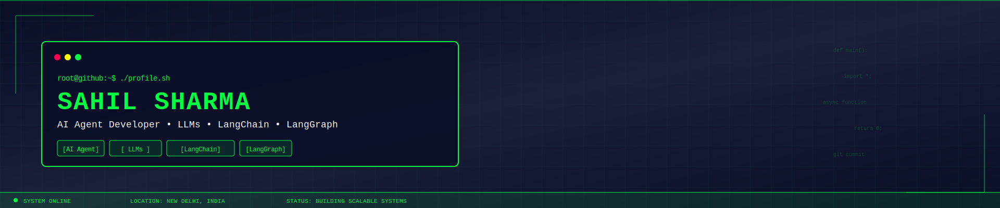

<!-- ====== ANIMATED SVG BANNER ====== -->

  

<!-- ====== INTRO SECTION ====== -->
<h1 align="center">👋 Hi, I'm Sahil Sharma</h1>
<h3 align="center">AI Agent Developer | LLMs | LangChain | LangGraph | RAG Systems</h3>

---

### 🧠 About Me

I'm a **self-taught AI Agent Developer** from **India**, focused on building systems that go beyond chat —  
**agents that can think, decide, and execute real-world tasks.**

I learn by building practical, real-world projects involving:
- Tool execution  
- Automation workflows  
- Multi-step reasoning using LLMs  

> I believe: **AI becomes powerful when it moves from answering → executing.**

---

### ⚙️ Tech Stack

#### 🤖 AI / LLM

#### 💻 Languages  

#### 🧰 Tools & Systems  

#### ☁️ Deployment (Learning & Building)

---

### 🧠 AI Engineering Focus

- 🤖 Building **AI agents using LangChain & LangGraph**
- 🧠 Developing **RAG (Retrieval-Augmented Generation) systems**
- 🗄️ Working with **Vector Databases** (learning & implementing)
- ⚡ Exploring **Redis & background workers** for async execution
- ☁️ Learning **deployment of AI systems on AWS / GCP**
- 🚀 Focused on building **production-ready AI agents (not just demos)**

---

### 🧩 Featured Projects *(Building AI Agents)*

| Project | Description | Tech Stack |
|:--|:--|:--|
| **AI Task Execution Agent** | Executes tasks like job search, data extraction, and file saving | LangChain, Python |
| **AI Research Agent** | Breaks queries into sub-tasks and gathers data from multiple sources | LangChain, APIs |
| **Web Automation Agent** | Scrapes and processes real-world web data automatically | Python, BeautifulSoup |
| **Next Projects** | Multi-agent systems, RAG pipelines, production workflows | In Progress |

> 💡 Focus: **Real execution > simple chatbots**

---

### 📊 GitHub Insights

  
   
  

---

### 🧠 Current Focus

- Building **real AI agents daily**
- Improving **reliability & structured outputs**
- Moving from **prototype → production systems**

---

### 🤝 Connect With Me

  
  
  

---

### 🧩 Quote

> "AI is not useful when it talks. It’s useful when it works."

---

### 🐍 Contribution Snake

  

---

**Building in public**
