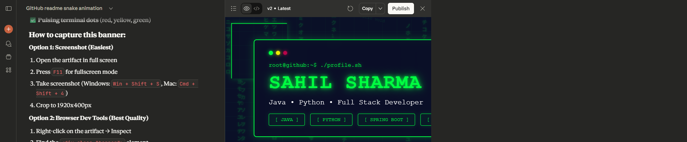

<!-- ====== BANNER AT TOP ====== -->

  

<!-- ====== INTRO SECTION ====== -->
<h1 align="center">👋 Hi, I'm Sahil Sharma</h1>
<h3 align="center">Expert Developer | Java & Python | Building Scalable, Modern Solutions</h3>

---

### 🧠 About Me

I'm a **self-taught developer** from **New Delhi, India**, passionate about building fast, reliable, and elegant software systems.  
I specialize in **Java** and **Python**, crafting solutions that combine strong backend logic with clean architecture and performance.

- 💼 Working on personal frameworks and production-grade systems  
- 🧩 Exploring system design, AI integration, and backend optimization  
- 🌐 Always open to collaboration and innovative ideas  
- 🏗️ Currently setting up new repositories showcasing enterprise-grade architecture and best practices  

---

### ⚙️ Tech Stack

#### 💻 Languages  

#### 🧰 Frameworks & Tools  

---

### 🧩 Featured Projects *(coming soon)*

| Project | Description | Tech Stack |
|:--|:--|:--|
| **Enterprise Task Engine** | A backend microservice architecture for distributed task handling | Java, Spring Boot, Redis |
| **Vision AI Framework** | Lightweight Python framework for computer vision workflows | Python, FastAPI |
| **DevOps Dashboard** | Real-time CI/CD dashboard for developers | Docker, Node.js, MongoDB |

> 💡 Repositories launching soon with complete documentation and live demos.

---

### 📊 GitHub Insights

  
   
  

---

### 🤝 Connect With Me

  
  
  

---

### 🧩 Quote

> "Code is like humor. When you have to explain it, it's bad." — Cory House

---

### 🐍 Contribution Snake

  

